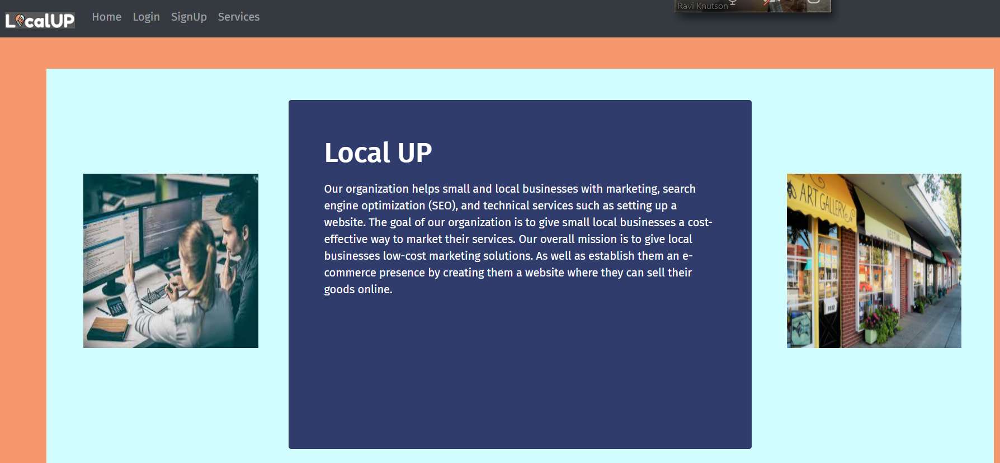
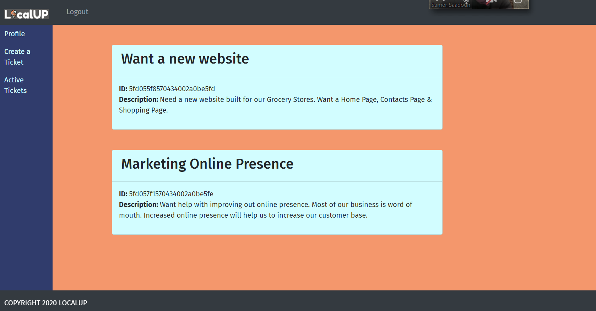
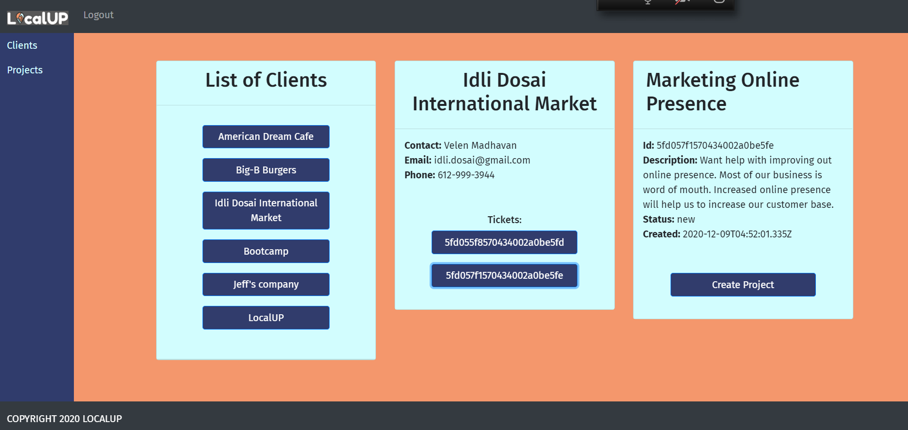

# Local-Up
## Links
Application URL : https://localup.herokuapp.com

Github Repositroy : https://github.com/meenaambalam/local-up
## Description
Local-UP is a MERN app designed to be a project management system that will help fresh devs to work together on building websites and other e-services for local businesses.  
The app is built with Nodejs, mongoDB, express, JWT, Bcrypt in the backend. Mainly React on the front-end.  
There are 3 portals. 
- Clients dashboard  
- Admins dashboard  
- Developers dashboard (under development)

The client can create a ticket(request of service) after signing up. The ticket appears in the Admins dashboard, from which the admin can create a project and assign developers to work on it. The project contains "tickets", which are the building blocks for the project.

## Table of Contents 
* [Installation](#Installation)
* [Usage](#Usage)
* [Contributing](#Contributing)
* [Screenshots](#Screenshots)
* [Future-Developments](#Future-Developments)

## Installation
To install necessary dependencies, run the following command:
```
npm i => Node JS, Express, axios, react, react-router-dom, mongoose, react-bootstrap, concurrently, react-reveal, nodemon, JWT, Bcrypts
```
## Usage
You will need node.js, be able to init the project using npm init, and then install the dependencies encased in the package.json using npm i

## Contributing
The team behind this app:
  * [Meena Ambalam](https://github.com/meenaambalam)
  * [Jeff Thao](https://github.com/JeffThao)
  * [Ravi Knutson](https://github.com/Knuts839)
  * [Samer Saadoun](https://github.com/samergain)

## Screenshots
<ins>Initial Page Load Screenshot:</ins>



<ins>Client Page functionality Screenshot - Active Tickets:</ins>



<ins>Admin Page Client Information Screenshot:</ins>



## Future-Developments: 
The project is still under development. The next step is building the 'Developers Portal' and 'Live Chat' service for the clients.


